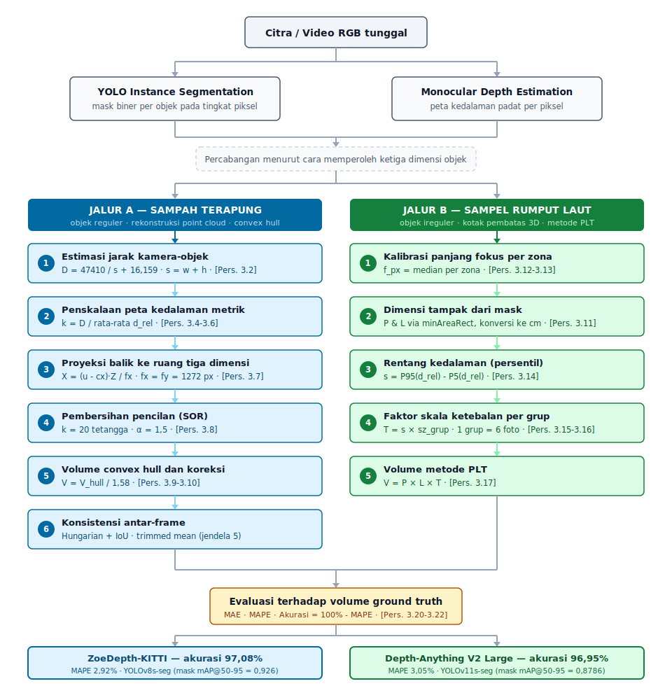

# Estimasi Volumetrik Objek dari Kamera RGB

Implementasi pipeline estimasi volume objek tiga dimensi hanya menggunakan **satu kamera RGB biasa**, tanpa LiDAR maupun kamera stereo, dengan memadukan **YOLO instance segmentation** dan **Monocular Depth Estimation (MDE)**.

Repositori ini merupakan kode pendamping Tugas Akhir:

> **Estimasi Volumetrik Objek dari Kamera RGB Menggunakan YOLO Instance Segmentation dan Monocular Depth Estimation**
> Rumaisha Afrina (NRP 5025221146)
> Departemen Teknik Informatika, FTEIC, Institut Teknologi Sepuluh Nopember
> Dosen Pembimbing: Prof. Drs.Ec. Ir. Riyanarto Sarno, M.Sc., Ph.D.
> Dosen Ko-pembimbing: Dr. Kelly Rossa Sungkono, S.Kom., M.Kom.

---

## Ringkasan Hasil

| Studi Kasus | Model YOLO Terbaik | mask mAP@50-95 | Model MDE Terbaik | MAPE | Akurasi |
|---|---|---|---|---|---|
| Sampah terapung | YOLOv8s-seg | 0,926 | ZoeDepth-KITTI | 2,92% | **97,08%** |
| Sampel rumput laut | YOLOv11s-seg | 0,8786 | Depth-Anything V2 Large | 3,05% | **96,95%** |

**Temuan utama:** tidak ada satu pun model MDE yang unggul secara universal. Model kedalaman **metrik** (ZoeDepth) lebih cocok untuk rekonstruksi convex hull, sedangkan model kedalaman **relatif** (Depth-Anything V2) lebih cocok untuk metode PLT. Pemilihan model MDE bergantung pada metode volume yang digunakan.

---

## Arsitektur Pipeline

<p align="center">
  
</p>

Kedua jalur berbagi dua tahap awal yang sama, yaitu instance segmentation untuk membatasi objek pada tingkat piksel dan monocular depth estimation untuk memperoleh informasi kedalaman. Percabangan setelahnya ditentukan oleh **cara memperoleh ketiga dimensi objek**, bukan semata-mata oleh kompleksitas bentuknya.

Deskripsi lengkap tiap tahap tersedia pada [`docs/PIPELINE.md`](docs/PIPELINE.md).

---

## Instalasi Cepat

```bash
# 1. Klon repositori
git clone https://github.com/USERNAME/volumetric-estimation-rgb.git
cd volumetric-estimation-rgb

# 2. Buat lingkungan virtual
python -m venv .venv
source .venv/bin/activate          # Windows: .venv\Scripts\activate

# 3. Pasang dependensi
pip install -r requirements.txt

# 4. Verifikasi instalasi
pytest tests/ -v
```

Panduan lengkap termasuk pemasangan GPU dan penanganan galat umum tersedia pada [`docs/INSTALASI.md`](docs/INSTALASI.md).

---

## Alur Penggunaan

Terdapat lima langkah berurutan. Tiap langkah memiliki script mandiri di folder `scripts/`.

### Langkah 1 — Melatih model YOLO

```bash
# Melatih satu varian
python scripts/01_train_yolo.py \
    --data datasets/waste/data.yaml \
    --model yolov8s-seg.pt \
    --epochs 100 \
    --name waste-yolov8s

# Melatih keempat varian sekaligus untuk perbandingan
python scripts/01_train_yolo.py \
    --data datasets/waste/data.yaml \
    --all-variants \
    --name-prefix waste
```

Bobot terbaik tersimpan di `runs/segment/<nama>/weights/best.pt`. Salin ke folder `weights/`.

### Langkah 2 — Kalibrasi jarak kamera

Langkah ini **hanya perlu diulang bila menggunakan kamera selain Logitech C310**. Konstanta hasil kalibrasi penelitian ini sudah tertanam di `src/common/config.py`.

```bash
python scripts/02_calibrate_distance.py \
    --csv data/calibration_distance.csv \
    --plot assets/kurva_kalibrasi.png
```

Keluaran yang diharapkan: `a = 47410,67` dan `b = 16,15837`, yang pada buku Tugas Akhir dibulatkan menjadi `D = 47410 / s + 16,159`.

### Langkah 3 — Estimasi volume sampah terapung

```bash
python scripts/03_run_waste_pipeline.py \
    --weights weights/yolov8s-seg-waste.pt \
    --video data/videos/uji.mp4 \
    --mde zoedepth-kitti \
    --ground-truth data/ground_truth_waste.csv \
    --output results/waste_zoedepth_kitti.csv
```

### Langkah 4 — Estimasi volume rumput laut

```bash
python scripts/04_run_seaweed_pipeline.py \
    --weights weights/yolo11s-seg-seaweed.pt \
    --samples data/seaweed_samples.csv \
    --mde dav2-large \
    --output results/seaweed_dav2_large.csv
```

### Langkah 5 — Membandingkan keenam model MDE

Mereproduksi Tabel 4.4 dan Tabel 4.7 pada buku Tugas Akhir.

```bash
python scripts/05_compare_mde_models.py \
    --case waste \
    --weights weights/yolov8s-seg-waste.pt \
    --video data/videos/uji.mp4 \
    --ground-truth data/ground_truth_waste.csv \
    --output results/perbandingan_mde_sampah.csv
```

Contoh dan opsi lengkap tiap perintah tersedia pada [`docs/PENGGUNAAN.md`](docs/PENGGUNAAN.md).

---

## Penggunaan sebagai Pustaka

```python
from src.waste.pipeline import WasteVolumePipeline

pipeline = WasteVolumePipeline(
    yolo_weights="weights/yolov8s-seg-waste.pt",
    mde_model="zoedepth-kitti",
)

hasil = pipeline.process_video("data/videos/uji.mp4")

for track_id, info in hasil["tracks"].items():
    print(f"{info['class_name']}: {info['volume_cm3']:.2f} cm3")
```

```python
from src.seaweed.pipeline import SeaweedVolumePipeline, load_samples_from_csv

samples = load_samples_from_csv("data/seaweed_samples.csv")

pipeline = SeaweedVolumePipeline(
    yolo_weights="weights/yolo11s-seg-seaweed.pt",
    mde_model="dav2-large",
)
pipeline.calibrate(samples)      # Tahap 1: kalibrasi dua tahap
hasil = pipeline.estimate(samples)   # Tahap 2: estimasi volume
```

---

## Struktur Repositori

```
volumetric-estimation-rgb/
├── README.md
├── requirements.txt
├── requirements-optional.txt
├── assets/
│   └── pipeline.svg                  # Diagram arsitektur pipeline
├── configs/
│   ├── waste.yaml                    # Konfigurasi jalur sampah
│   └── seaweed.yaml                  # Konfigurasi jalur rumput laut
├── data/
│   ├── calibration_distance.csv      # 16 titik kalibrasi (Lampiran 3)
│   ├── ground_truth_waste.csv        # 9 spesimen sampah (Tabel 3.1)
│   └── seaweed_samples_example.csv   # Contoh format CSV sampel
├── docs/
│   ├── INSTALASI.md
│   ├── PENGGUNAAN.md
│   ├── PIPELINE.md                   # Penjabaran metodologi & persamaan
│   └── DATASET.md
├── scripts/
│   ├── 01_train_yolo.py
│   ├── 02_calibrate_distance.py
│   ├── 03_run_waste_pipeline.py
│   ├── 04_run_seaweed_pipeline.py
│   └── 05_compare_mde_models.py
├── src/
│   ├── common/
│   │   ├── config.py                 # Seluruh konstanta penelitian
│   │   ├── depth_models.py           # Pemuat 6 model MDE
│   │   ├── segmentation.py           # Pembungkus YOLO + minAreaRect
│   │   └── metrics.py                # MAE, MAPE, akurasi
│   ├── calibration/
│   │   └── distance.py               # D = a/s + b (curve_fit)
│   ├── waste/
│   │   ├── pointcloud.py             # Proyeksi balik + SOR
│   │   ├── convex_hull.py            # Volume hull + koreksi 1,58
│   │   ├── tracking.py               # Hungarian + IoU + trimmed mean
│   │   └── pipeline.py               # Orkestrasi Kode Semu 3.1
│   └── seaweed/
│       └── pipeline.py               # Orkestrasi Kode Semu 3.2
└── tests/
    └── test_core.py                  # 23 uji unit
```

---

## Konstanta Penelitian

Seluruh nilai berikut terpusat di [`src/common/config.py`](src/common/config.py).

| Parameter | Nilai | Sumber |
|---|---|---|
| Panjang fokus `fx`, `fy` | 1272 piksel | Persamaan (3.1), FOV diagonal 60° |
| Titik utama `cx`, `cy` | (640, 360) | Persamaan (3.1) |
| Konstanta jarak `a` | 47410 | Persamaan (3.2), regresi 16 titik |
| Konstanta jarak `b` | 16,159 | Persamaan (3.2) |
| SOR `nb_neighbors` | 20 | Persamaan (3.8) |
| SOR `std_ratio` | 1,5 | Persamaan (3.8) |
| Faktor koreksi hull | 1,58 (pembagi) | Persamaan (3.10) |
| Jendela trimmed mean | 5 frame | Subbab 3.6.5 |
| Persentil rentang kedalaman | P95 dan P5 | Persamaan (3.14) |
| Ambang confidence | 0,50 (sampah); 0,25 (rumput laut) | Tabel 3.4 |

---

## Enam Model MDE yang Dievaluasi

| Kunci | HuggingFace ID | Jenis Keluaran |
|---|---|---|
| `zoedepth-kitti` | `Intel/zoedepth-kitti` | Metrik (outdoor) |
| `zoedepth-nyu` | `Intel/zoedepth-nyu` | Metrik (indoor) |
| `dav2-base` | `depth-anything/Depth-Anything-V2-Base-hf` | Relatif |
| `dav2-large` | `depth-anything/Depth-Anything-V2-Large-hf` | Relatif |
| `midas-beit-l512` | `Intel/dpt-beit-large-512` | Relatif |
| `dpt-large` | `Intel/dpt-large` | Relatif |

Model diunduh otomatis dari HuggingFace Hub saat pertama kali dipanggil.

---

## Catatan Penting

**Faktor koreksi 1,58.** Faktor ini diturunkan dari dataset yang sama dengan dataset evaluasi, dan hal tersebut dinyatakan secara terbuka pada buku Tugas Akhir. Yang menopang kelayakannya adalah konsistensi galat, yaitu MAPE bertahan di sekitar 3 persen pada rentang volume yang membentang lebih dari 400 kali lipat, dari 10,60 cm³ hingga 4200,00 cm³. Konsistensi tersebut menunjukkan bahwa faktor ini menangkap bias geometrik sistematik convex hull, bukan sekadar menyesuaikan diri terhadap sekumpulan nilai tertentu.

**Kalibrasi bersifat spesifik perangkat.** Konstanta jarak (`a`, `b`) berlaku untuk webcam Logitech C310, sedangkan panjang fokus per zona berlaku untuk Poco M4 Pro 4G dan Samsung Galaxy A53 5G. Replikasi dengan perangkat lain memerlukan kalibrasi ulang melalui Langkah 2.

**Open3D bersifat opsional.** Penelitian asli menggunakan Open3D untuk Statistical Outlier Removal. Repositori ini menyertakan implementasi pengganti berbasis `scipy.spatial.cKDTree` yang menghasilkan nilai setara, sehingga Open3D tidak wajib dipasang.

**Model MDE digunakan tanpa fine-tuning.** Keenam model dievaluasi dengan bobot pre-trained bawaan, sehingga belum dioptimalkan untuk karakteristik visual objek di lingkungan perairan.

---

## Sitasi

```bibtex
@thesis{afrina2026volumetrik,
  author      = {Rumaisha Afrina},
  title       = {Estimasi Volumetrik Objek dari Kamera RGB Menggunakan
                 YOLO Instance Segmentation dan Monocular Depth Estimation},
  school      = {Institut Teknologi Sepuluh Nopember},
  address     = {Surabaya, Indonesia},
  year        = {2026},
  type        = {Tugas Akhir Sarjana}
}
```

---

## Lisensi

Dirilis di bawah Lisensi MIT. Lihat [`LICENSE`](LICENSE).

Model dan pustaka pihak ketiga tunduk pada lisensi masing-masing. Perlu dicatat bahwa Ultralytics YOLO dirilis dengan lisensi **AGPL-3.0**, yang memiliki implikasi tersendiri untuk penggunaan komersial.
